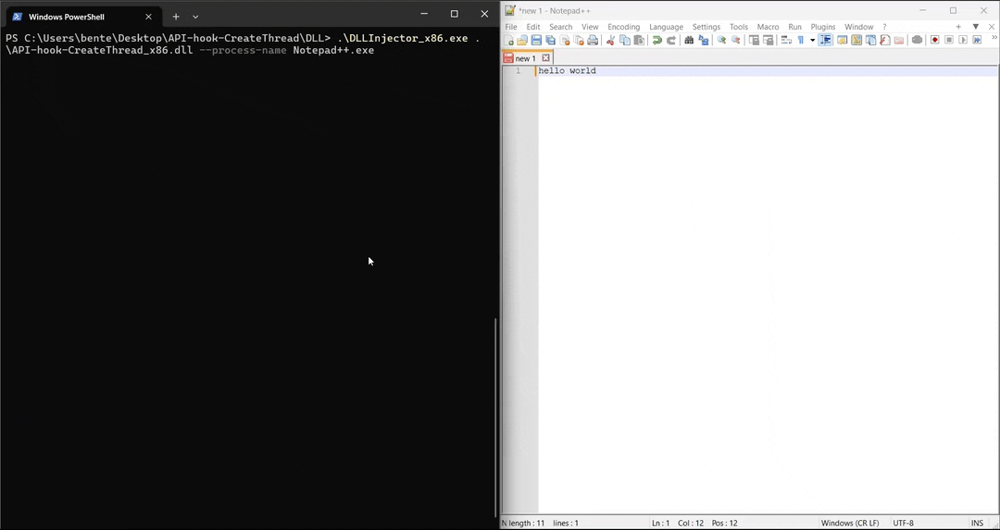

# API Hooking with Microsoft Detours

API hooking is a technique used for intercepting and modifying the behavior of functions at runtime.
This can be used for debugging, ... .
This repository provides two examples of API hooking functions of the Windows API using [Microsoft Detours](https://github.com/microsoft/Detours).

## Mechanism


## Example

The first example demonstrates hooking the well-documented `CreateThread` function in `kernel32.dll`.
The second example showcases hooking the less-documented `NtCreateThreadEx` function in `ntdll.dll`.
Although this function is not officially documented, the necessary function signature can be found online.
To find the address of this function, we use `GetProcAddress()`.

To create the hooks, we first need to create a DLL file.
This DLL will contain our hook functions, and a way to install the API hooks.
When the DLL is installed, it will open a console window that will show whenever the hooks are triggered.

For this, we also need a [DLL injector](https://github.com/BenteVE/DLL-Injector).
When the DLL is injected, we use Microsoft Detours to install the hooks.
Whenever the target program then wants to use the original function, our hook function in the injected DLL will be called instead.

## Demo

1. Clone this repository:

    ```bash
    git clone https://github.com/yourusername/API-Hooking-Examples.git
    ```

2. Build the DLL for the desired architecture using Visual Studio.
   The architecture of the DLL should match the architecture of the target program and the used DLL injector.

3. Use a DLL injector to inject the built DLLs into the target processes.

4. By examining both examples, it becomes apparent that the `CreateThread` function internally uses the `NtCreateThreadEx` function.


