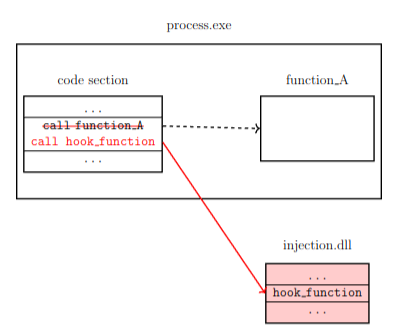
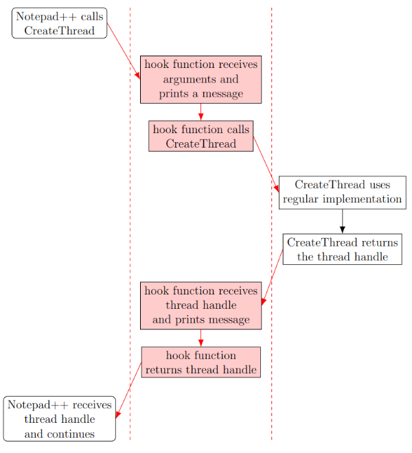
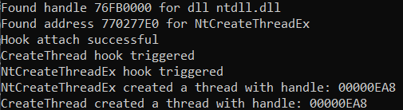

# API Hooking with Microsoft Detours

API hooking is a technique used for intercepting and modifying the behavior of functions at runtime.
This can be used for debugging and analyzing programs.
This repository provides an example of API hooking using [Microsoft Detours](https://github.com/microsoft/Detours) in combination with DLL injection to analyze the behaviour of 2 functions of the Windows API.

## General method

In this project, we create a DLL that will be injected in a target process.
The DLL contains 2 hook functions and the code to install them with Microsoft Detours.

Microsoft Detours will modify the program so the hook function will be called instead of the original function:



To make sure the program doesn't crash when installing a hook, the hook should have the same function signature and return type as the original function.
The hook function should also call the original function or implement similar behaviour so the program can continue as expected.

## Implementation

The first function we will hook is the well-documented `CreateThread` function in `kernel32.dll`.
The documentation for this function can be found on the official [Microsoft website](https://learn.microsoft.com/en-us/windows/win32/api/processthreadsapi/nf-processthreadsapi-createthread).

The second function is the `NtCreateThreadEx` function in `ntdll.dll`.
Although this function is not officially documented by Microsoft, the necessary function signature can be found online.
To find the address of this function at runtime, we use `GetProcAddress()`.

To analyze the behaviour of the functions, each hook function will first log a message when they are called.
Then, the hook function will call the function that was originally supposed to be called.
Once the original function is finished, the hook function will regain control and print a message with the return value of the original function. In the following demo, we will use Notepad++ as the target application.



## Demo

1. Clone the repository:

    ```bash
    git clone https://github.com/BenteVE/API-hook-CreateThread.git
    ```

2. Build the DLL for the desired architecture (x86 or x64) using Visual Studio.
   The architecture of the DLL should match the architecture of the target program and the used DLL injector.

3. Use a DLL injector to inject the built DLLs into the target processes.
   The injector used here is available in another [repository](https://github.com/BenteVE/DLL-Injector) with a detailed explanation.

   When the DLL is installed, it will open a console window to show some output.
   After that, we simply need to take any action that will call the function we hooked.
   For example: when saving a file in Notepad++ we see that `CreateThread` is called multiple times:

    

4. By examining the output, it becomes apparent that the `CreateThread` function internally uses the `NtCreateThreadEx` function:

    

    When we save a file in Notepad++, the `CreateThread` function hook is triggered multiple times.
    Each time that hook is triggered, the `NtCreateThreadEx` function hook is later also triggered.
    The `NtCreateThreadEx` function then returns a thread handle, followed by `CreateThread` returning that same handle.
